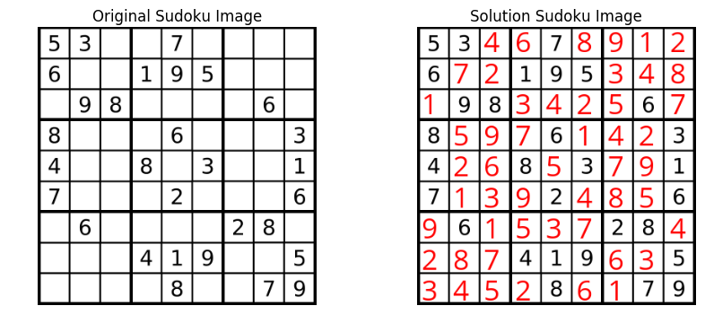

# SeeSudoku
A python package to solve sudoku from its image. Just give the sudoku image as the input.

## Usage


Please download the model from the following link and put it inside the ```model`` folder.

* https://s3-us-west-2.amazonaws.com/model-seesudoku/model_weights.h5

```python
import seesudoku
```

```python
seesudoku.get_solution_im('./sudoku1.png')  # This writes the solution image to same path
```


```python
# Show the solution
from skimage import io
import matplotlib.pyplot as plt
%matplotlib inline
fig = plt.figure()
fig.set_size_inches(10, 4)
plt.subplot(1,2,1); plt.imshow(io.imread('./sudoku1.png')); plt.title('Original Sudoku Image'); h = plt.axis('off')
plt.subplot(1,2,2); plt.imshow(io.imread('./sudoku1_sol.png')); plt.title('Solution Sudoku Image'); h = plt.axis('off');
```





## Brief Technical Explanation

* Sudoku image is divided into 9x9 to crop the images. 
* Each crop is analyzed to detect whether it is blank or a digit
* A Convolutional Neural Net is trained on synthetic (computer fonts) digit dataset. Link to dataset: http://www.ee.surrey.ac.uk/CVSSP/demos/chars74k/. Digit images are put into this CNN.
* After getting the digits, we get the 9x9 numpy array of the sudoku.
* Sudoku is solved using backtracking algorithm.
* Solution digits are added as red onto the original image.

More details and the CNN architecture can be found in the notebooks folder.

## Tools Used
* Keras
* skimage
* PIL
